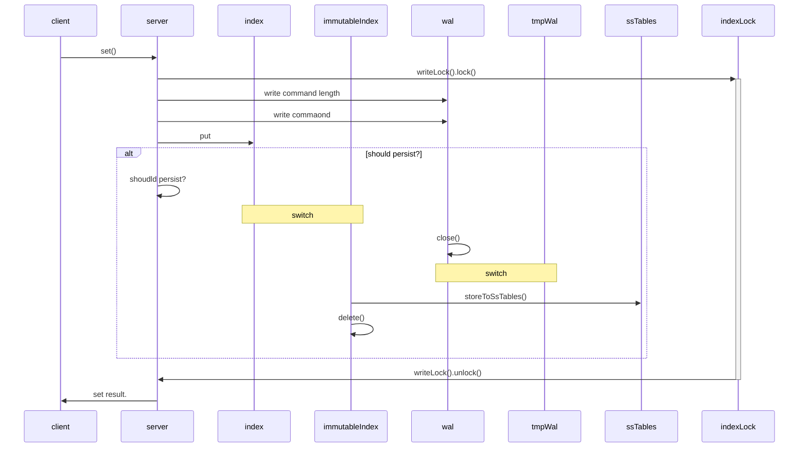
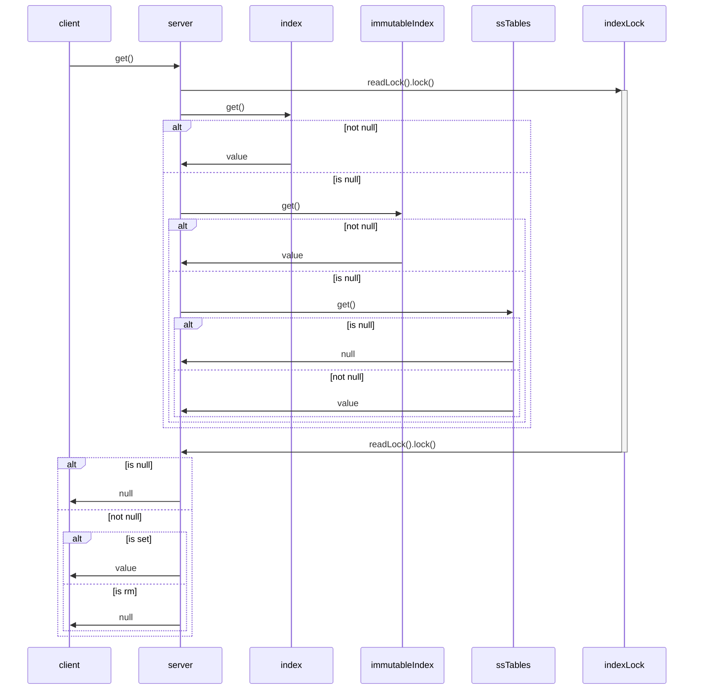
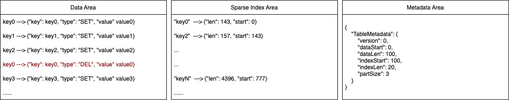
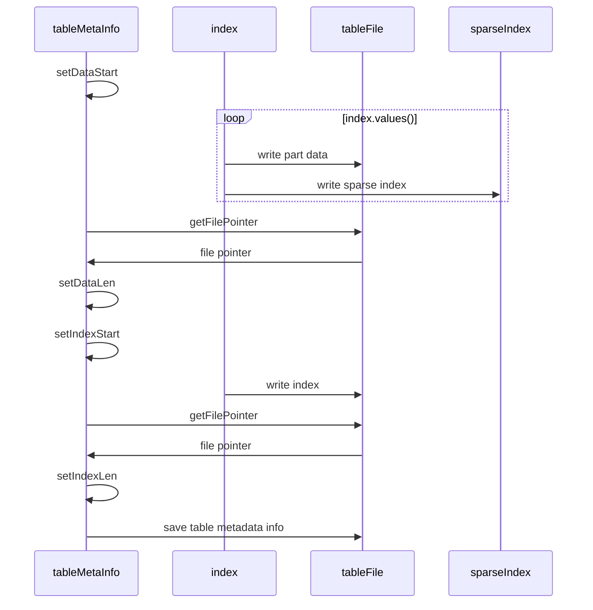
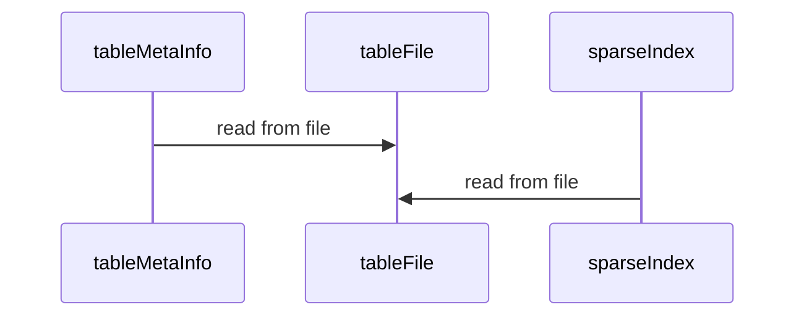

# simple-lsm-db

simple database based on LSM, previously on [simple-hash-db](https://github.com/0x822a5b87/simple-hash-db) I created a simple hash-index database which contains many problem such as performance and efficiency.However, I'm not familiar with cpp, so I decided to create a new project using `Golang` to solve this problem.

## reference

- [从零开始写数据库：500行代码实现 LSM 数据库](https://zhuanlan.zhihu.com/p/374535126)
- [TinyKvStore](https://github.com/x-hansong/TinyKvStore)
- [SSTable](https://www.scylladb.com/glossary/sstable/)

## required


## feature

- `SSTable` use SSTable instead of single file for higher compact performance
- `sparse index` use sparse index instead of memory-hash index for
  - lower memory
  - reduce IO cost
  - range query
- `WAL` use write ahead log to improve the reliability
- `cache` use cache to improve query performance

## sequence graph

### set



### get



### .table



### SsTable#initFromIndex



### SsTable#restoreFromFile



### SsTable#query

```mermaid

```

## code analysis for TinyKvStore

### code structure

1. we store `Command` instead of store raw data directly, so we do not need `GetCommand`. When we invoke `get`, we search the last `SetCommand` in order of `memory index`, `persisting SSTable`， `persisted SSTable`.

```
src/main/java/com/xiaohansong/kvstore/
        ├── model
        │     ├── Position.java
        │     ├── command
        │     │     ├── AbstractCommand.java                     abstract command with CommandTypeEnum
        │     │     ├── Command.java                             command interface
        │     │     ├── CommandTypeEnum.java                     command type
        │     │     ├── RmCommand.java                           rm command
        │     │     └── SetCommand.java                          set command
        │     └── sstable
        │         ├── SsTable.java                               
        │         └── TableMetaInfo.java
        ├── service
        │     ├── KvStore.java
        │     └── LsmKvStore.java
        └── utils
              ├── ConvertUtil.java                               convert JSONObject to Command
              └── LoggerUtil.java                                logger util
```

## code analysis for simple-lsm-db
